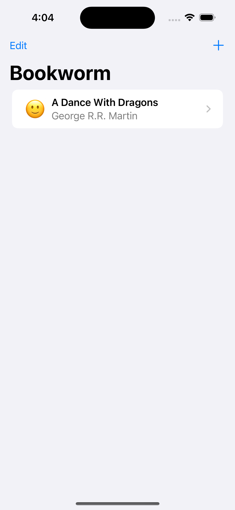
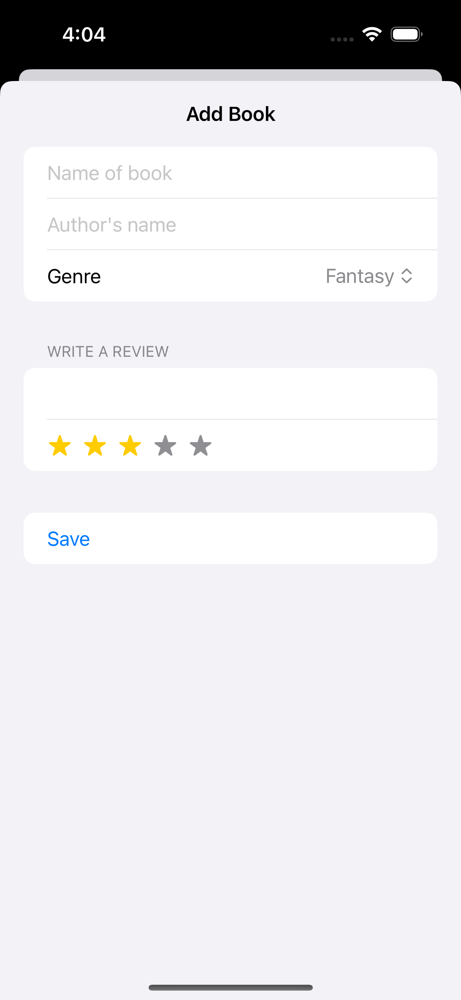
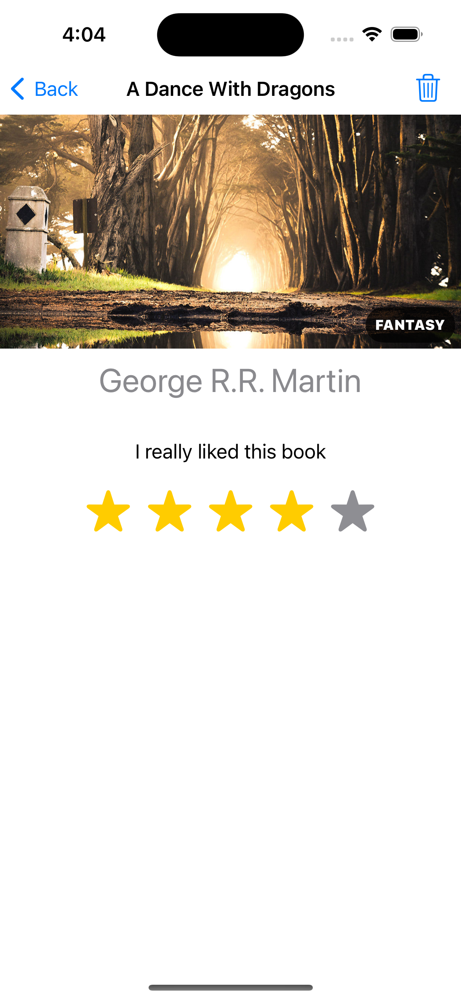

# Bookworm

Bookworm is an engaging iOS app crafted using SwiftUI, aimed at book enthusiasts who wish to store and manage their book reviews conveniently. Users can effortlessly record their thoughts about books they've read, rate them, and recall details about the authors and titles. Bookworm utilizes SwiftData for robust data storage

    
    
    

## Features

- **Review Storage**: Users can store their book reviews, which include a personal review, book title, author, and a rating system.
- **Easy Navigation**: Seamlessly navigate through different sections of the app to add new reviews or revisit old ones.
- **Data Persistence**: Leveraging SwiftUI, all data is persistently stored and easily accessible.
- **User Ratings**: Each book can be rated on a scale, helping users easily reflect on their reading experience.

## Technologies Used

- **SwiftUI**: Utilized for building the app's interface, ensuring a seamless and responsive user experience.
- **Swift**: The programming language used for developing the app's functionality, handling data storage and manipulation.
- **SwiftData**: Utilizes Swift's powerful data management capabilities to handle complex data storage and retrieval effectively.
- **Xcode**: The IDE for iOS app development, enabling the creation and testing of Bookworm.

## Getting Started

To run this project locally, you'll need:

- Xcode installed on your Mac.
- Clone this repository to your local machine.
- Open the project in Xcode.
- Build and run the project on a simulator or your iOS device.

## Credits

This project is part of the ["100 Days of SwiftUI"](https://www.hackingwithswift.com/100/swiftui) course by Paul Hudson. I learned how to build this game and further develop my SwiftUI skills through the course.

## Learning Experience

In addition to following the main project instructions, I completed extra challenges provided at the end of the course where there were no instructions.
